<div align="center">


# 👁 ARGUS

### Vulnerability Operations Center

**One console. Every signal.**

*Un prototype fonctionnel de Vulnerability Operations Center (VOC) unifié qui remplace vos dashboards éparpillés (Kibana, Zabbix, GLPI, MISP, RabbitMQ…) par une seule console SOC.*

[]()
[]()
[](./LICENSE)
[]()
[]()
[]()

</div>

---

## 📌 Contexte

> **Ce projet a été réalisé dans le cadre du stage d'été de la deuxième année du cycle d'ingénieur** de TBINI Mustapha Amin, au sein de la société **Gérance Informatique**, sous l'encadrement de **Mr. MDAOUKHI Adel**. Il constitue un livrable pédagogique et technique de fin de stage.
>
> **Ce n'est pas un logiciel commercial ni un projet open-source.** Consultez la [licence](./LICENSE) pour les conditions d'utilisation.

---

## 🎯 Vision du projet

Dans un SOC classique, un analyste bascule quotidiennement entre 5 à 8 outils dispersés — SIEM, ITSM, threat intelligence, broker, supervision — chacun avec son propre login, ses propres alertes, sa propre logique. Cette fragmentation opérationnelle est à l'origine de la majorité des angles morts défensifs.

**ARGUS** propose une réponse concrète à ce problème :

<div align="center">

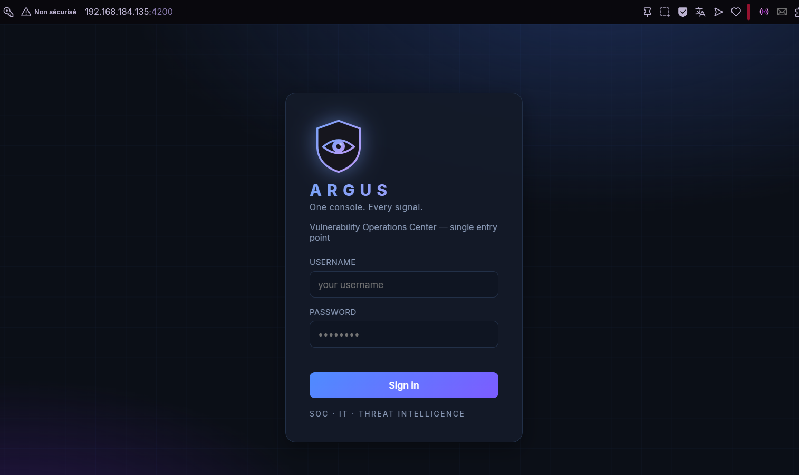

*Un point d'entrée unique, une identité visuelle claire, une promesse assumée : « One console. Every signal. »*

</div>

---

## ✨ Ce qu'ARGUS fait de bout en bout

```
DISCOVER → IDENTIFY ASSETS → DETECT VULNERABILITIES → CORRELATE CVEs
       ↓
ENRICH THREAT INTEL → CONTEXTUALIZE ASSET RISK → CALCULATE PRIORITY
       ↓
CREATE SLA → CREATE TICKET → ASSIGN OWNER → REMEDIATE → RE-SCAN
       ↓
VERIFY → CLOSE → MEASURE
```

Chaque étape est **automatisée**, **explicable** et **auditée**. Un ticket ne peut être clôturé qu'après une **vérification technique** par re-scan — pas par déclaration d'analyste.

---

## 🖼️ Aperçu de la plateforme

### 📊 Tableau de bord SOC unifié

Un dashboard qui expose en un seul écran l'état complet du parc : findings critiques, exposition KEV, conformité SLA, MTTR, tickets ouverts, tendance des vulnérabilités, activité en temps réel.

<div align="center">
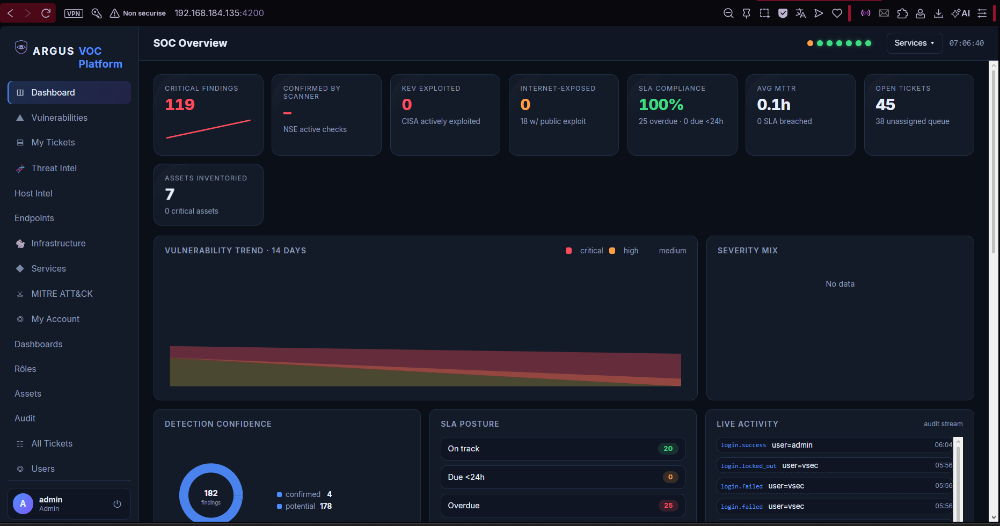
</div>

<div align="center">
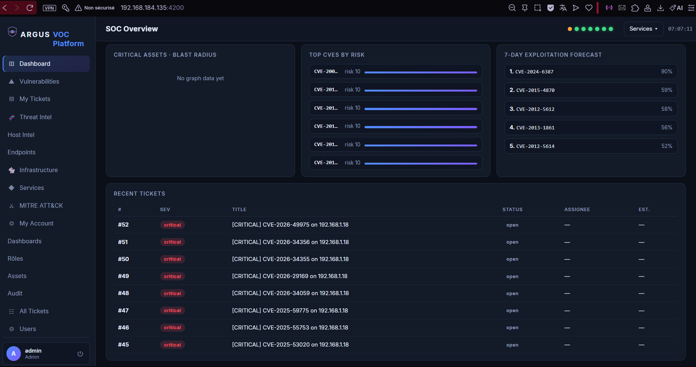
</div>

---

### 🔧 Tools Hub — l'orchestration unifiée

Chaque outil fédéré (Kibana, Elasticsearch, GLPI, MISP, RabbitMQ, Zabbix, Shuffle, Zeek) est présenté avec son état de santé en temps réel et un lien direct d'ouverture. Le menu contextuel « Services » offre un accès rapide à toutes les URLs natives.

<div align="center">
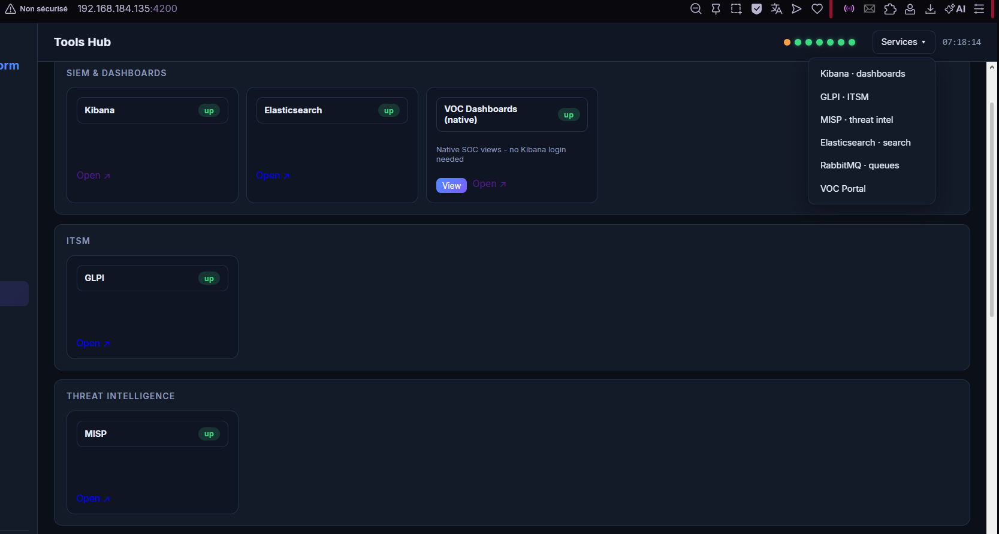
</div>

<div align="center">
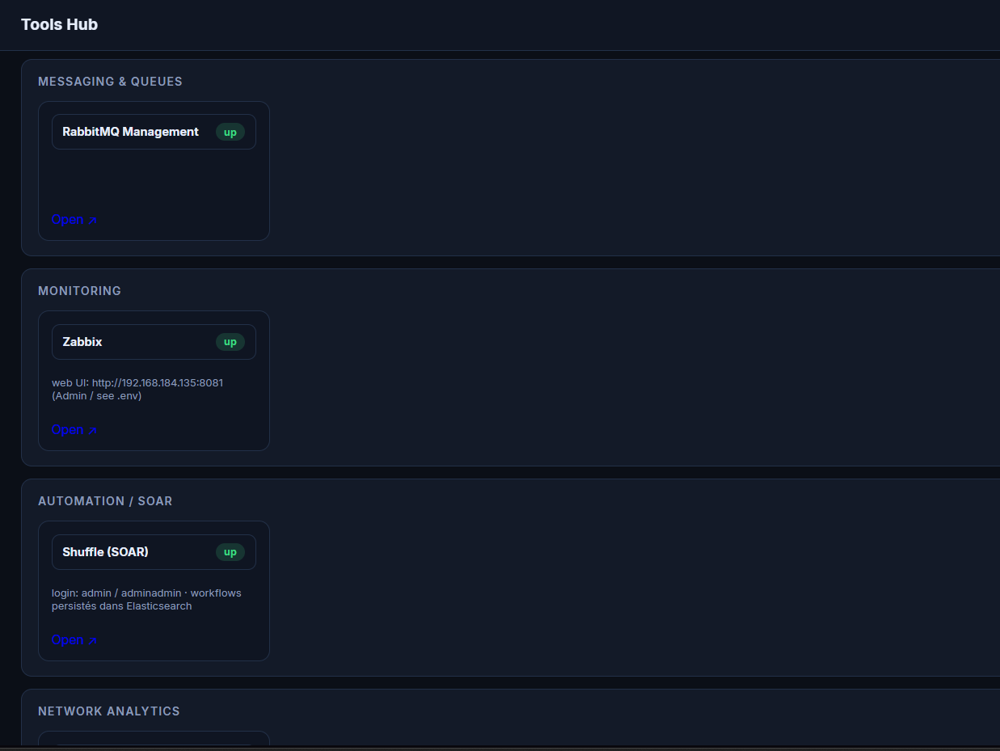
</div>

---

### 🖥️ Endpoint Activity — surveillance des machines

Vue fédérée des agents Elastic enrôlés et du trafic réseau observé, avec compteurs 24h : changements de fichiers, processus, hôtes surveillés.

<div align="center">
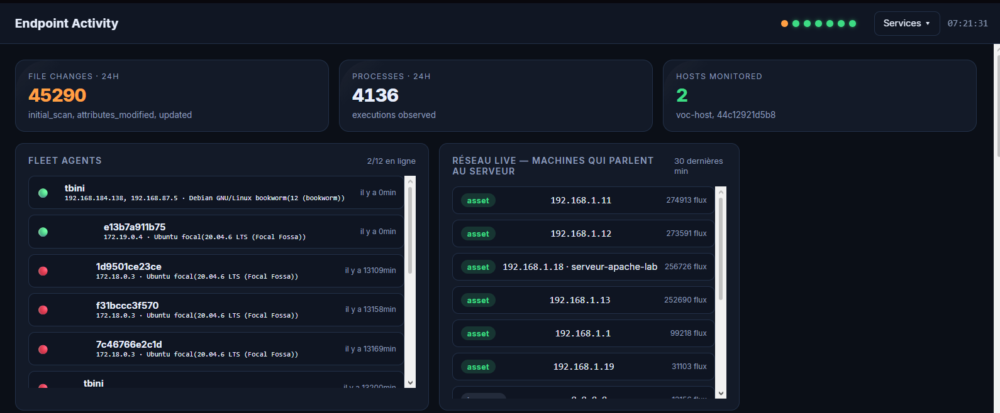
</div>

---

### 🎫 Gestion des tickets avec SLA

Vue complète des tickets automatiquement ouverts par le pipeline (risk ≥ 7) avec état SLA, sévérité, assignation, et actions rapides.

<div align="center">
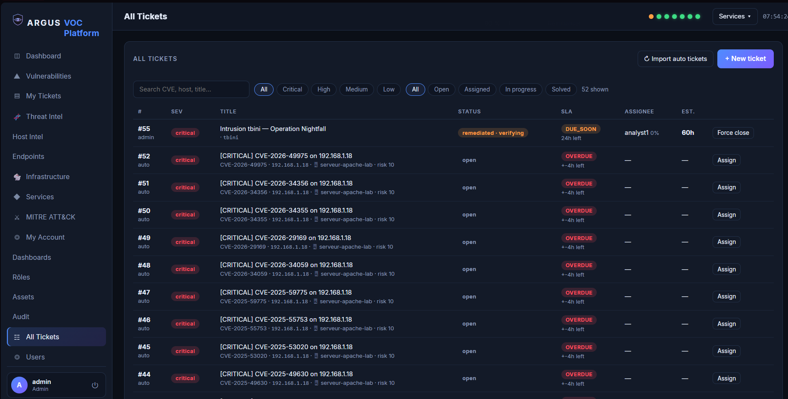
</div>

Détail d'un ticket avec CVE, risk score, CVSS, source, technique MITRE ATT&CK associée, et lien vers le ticket GLPI correspondant :

<div align="center">
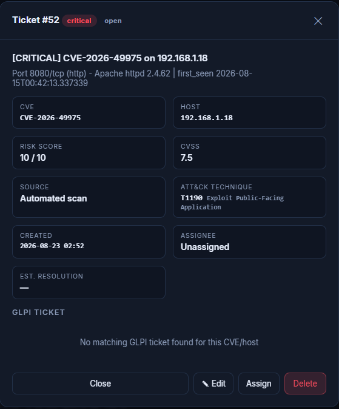
</div>

---

### 🔬 Détail d'une vulnérabilité — scoring explicable

Chaque vulnérabilité expose son **score de risque décomposé**, sa description NVD, les recommandations de remédiation et la chronologie complète de ses observations.

<div align="center">
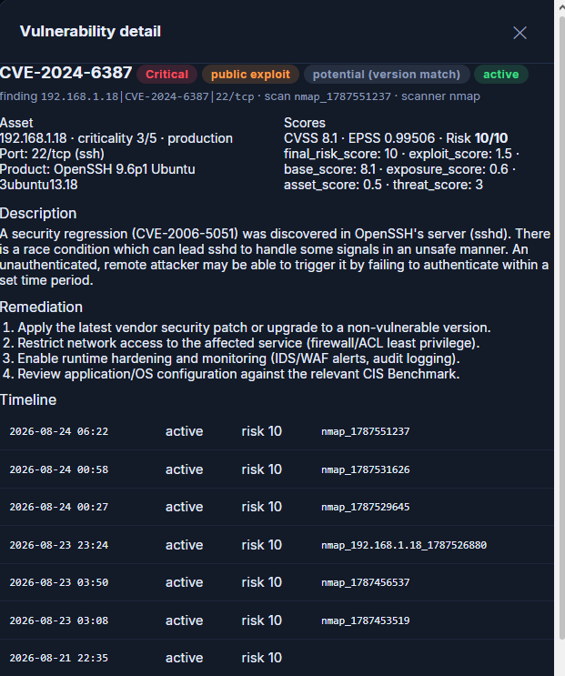
</div>

Composition transparente du score final : `base + threat + exploit + exposure + asset`, plafonné à 10.

---

### 🎯 Étude de cas — Operation Nightfall

**Une simulation d'attaque contrôlée** conduite dans le laboratoire depuis une station Kali contre la machine agent `tbini` (Debian 12), validant les capacités défensives du prototype.

#### Phase 1 — Reconnaissance (T1046 · MITRE ATT&CK)

<div align="center">
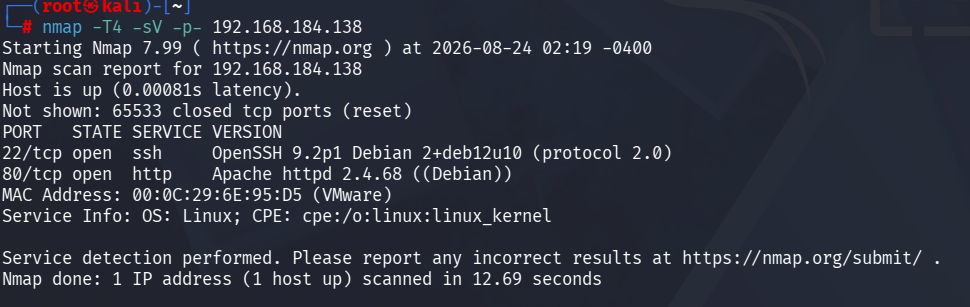
</div>

#### Phase 2 — Force brute SSH (T1110.001)

<div align="center">
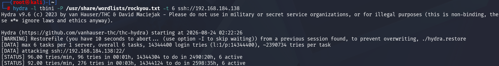
</div>

**Côté défensif** — le portail affiche immédiatement le mur de FAILED, chaque tentative attribuée à l'IP source (192.168.184.128) :

<div align="center">
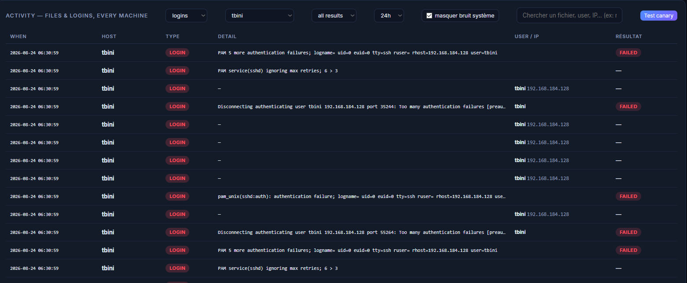
</div>

#### Phase 3 — Compromission (T1078)

Hydra trouve le mot de passe faible :

<div align="center">
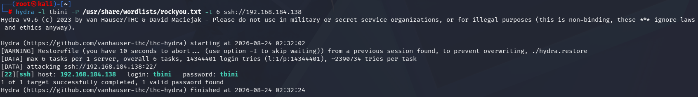
</div>

L'attaquant se connecte en SSH — le badge **SUCCESS** apparaît au milieu des FAILED, signal caractéristique de compromission :

<div align="center">
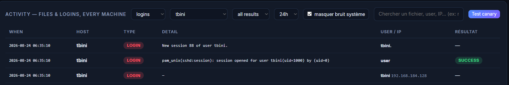
</div>

<div align="center">
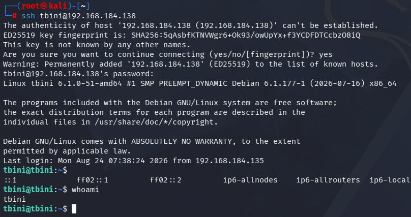
</div>

#### Phase 4 — Persistance (T1053)

L'attaquant tente d'installer un script de persistance dans `/etc/cron.d/`. Refusé sans privilèges — élévation via `sudo` :

<div align="center">
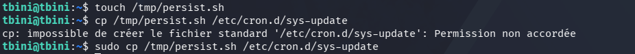
</div>

Le module FIM d'ARGUS capture chaque opération sur les chemins surveillés :

<div align="center">
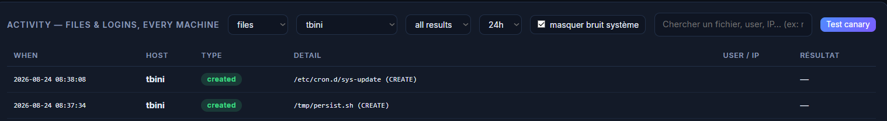
</div>

Création du compte de repli `svc_backup` :

<div align="center">
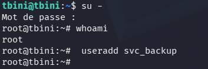
</div>

#### Phase 5 — Révélation par le Deep Scan authentifié

Le Deep Scan Ansible expose l'inventaire complet de la machine : **11 ports en écoute** et surtout **les deux comptes utilisateurs** — le compte légitime `tbini` et le compte de persistance `svc_backup` créé par l'attaquant.

<div align="center">
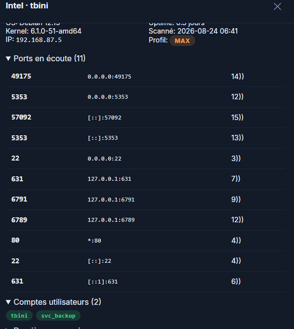
</div>

*Aucun scan externe ne peut fournir cette information : seule une collecte authentifiée par SSH permet d'énumérer les comptes locaux.*

#### Phase 6 — Traitement du ticket et vérification

Le module de routage intelligent présente les analystes candidats avec leur taux de résolution et leur charge :

<div align="center">
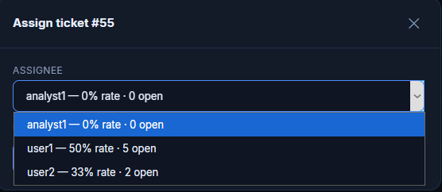
</div>

Vue analyste après assignation — l'analyst1 peut démarrer le traitement :

<div align="center">
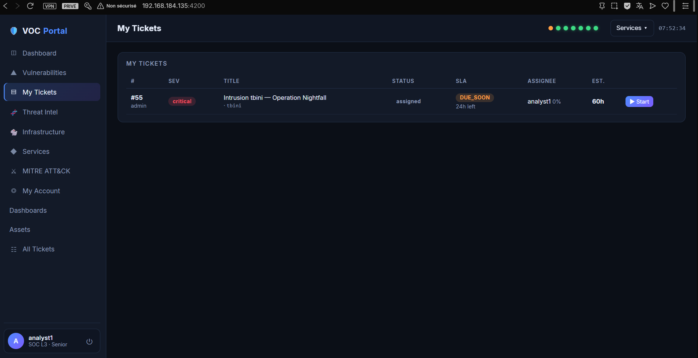
</div>

Après remédiation, le ticket passe à `remediated · verifying` en attente de la preuve technique par re-scan :

<div align="center">
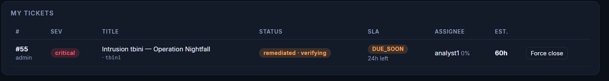
</div>

#### Phase 7 — Traçabilité par le journal d'audit

Chaque action est journalisée avec l'utilisateur, l'IP source, l'horodatage et le résultat :

<div align="center">
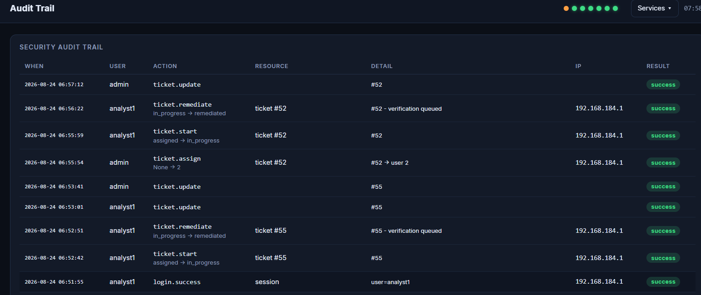
</div>

---

## 🏗️ Architecture technique

```
                        ┌───────────────────────────┐
   DISCOVERY_SUBNET ──▶ │ celery-worker             │
   (beat every 6h)      │  scan→enrich→enhance→     │──▶ risk-engine (/score)
                        │  score→index→ticket       │
                        └───────┬────────┬──────────┘
                     MISP API   │        │  Logstash HTTP :5044
                        ┌───────▼──┐  ┌──▼────────┐   ┌──────────────┐
                        │ MISP     │  │ Logstash  │──▶│ Elasticsearch│◀── Beats x5
                        └──────────┘  └───────────┘   │ + Kibana     │
                        ┌──────────┐                   └──────────────┘
                        │ GLPI ◀───┼── tickets          ▲
                        └──────────┘                    │ ES queries
                        ┌──────────┐                    │
                        │ portal   │────────────────────┘
                        │ (SPA+API)│── provisions users into ES/RMQ/GLPI/MISP
                        └──────────┘
```

**Isolation en 3 tiers** : les 20 conteneurs par défaut (26 avec les profils optionnels `zabbix` et `shuffle`) sont organisés en trois réseaux Docker isolés — `frontend`, `backend`, `data` — pour réduire la surface d'attaque en cas de compromission d'un service.

### 📚 Couches fonctionnelles

| Couche | Composants |
|---|---|
| **Pipeline** | Celery workers (`workers/tasks.py`), files `scan / enrich / score / index / ticket`, retries exponentielles, dead-letter queue |
| **Scanning** | `scanners/nmap_adapter.py`, `scanners/openvas_adapter.py` (GMP over TLS), base `ScannerAdapter` |
| **Assets** | `workers/assets.py` — index ES `assets-v1` (alias `assets`), identité stable MAC+IP+hostname |
| **Risk Engine** | `risk-engine/main.py` — modèle contextuel additif v3, authentification X-API-Key |
| **Threat Intel** | `nvd_client.py` (CPE/version-aware), `threat_intel.py` (EPSS/KEV/OSV/EDB/VT), `misp_client.py` |
| **Tickets** | GLPI REST (`glpi_client.py`), cycle de vie complet + SLA + verification bridge côté portail |
| **Notifications** | `notifications.py` — adaptateurs Telegram / Email / log, drainés depuis une file ES |
| **Data** | Elasticsearch indices quotidiens via Logstash (`source` routing), ILM policy `voc-retention` |
| **UI** | Portal SPA vanilla JS + FastAPI — 14+ onglets (dashboard, vulnérabilités, tickets, ATT&CK, MISP, GLPI, infra, audit…) |

---

## 🔐 Modèle de scoring de risque

Formule additive contextuelle **intégralement explicable** :

```
final = min(base + threat + exploit + exposure + asset, 10)

base     = score CVSS de base
threat   = KEV(+2.0) + EPSS≥0.5(+1.0) + MISP actif(+2.0)
exploit  = exploit public disponible (+1.5)
exposure = network_exposure × 2.0   (plancher 1.5 si Internet-exposed)
asset    = criticité 5 → +50% du CVSS · criticité 4 → +25% · env prod (+0.5)
           + attack-path relevance (≤ +1.0)
```

Tous les poids sont configurables via variables d'environnement (`RISK_*`). Chaque réponse inclut un breakdown machine-readable **et** une explication en langage naturel :

```
CVSS contribution:       7.5   base_score
EPSS 0.70 above 0.50:    +1.0  threat_score
Internet-exposed floor:  +1.5  exposure_score
Criticality 4/5:         +1.88 asset_score
Final Risk:              10/10 CRITICAL
```

---

## 🛰️ Threat Intelligence (6 sources fédérées)

| Source | Rôle |
|---|---|
| **NVD** | Corrélation CPE + version-range aware, extraction CWE, cache Redis |
| **EPSS** (FIRST) | Probabilité empirique d'exploitation par CVE |
| **CISA KEV** | Catalogue d'exploitations actives + flag ransomware |
| **MISP** | Enrichissement REST + publication d'événements enrichis |
| **OSV** | Signaux d'exploits open-source |
| **Exploit-DB** | Disponibilité d'exploits publics |

---

## 🎯 Vérification NSE — findings « confirmed » vs « potential »

Après chaque scan, une seconde passe Nmap exécute `--script "vuln and not (dos or intrusive)"` sur les ports ouverts uniquement (détection uniquement — scripts destructifs exclus). Chaque résultat `VULNERABLE` produit :

- `confidence: confirmed` + sortie brute du script comme `evidence`
- Sévérité extraite du script's risk factor, CVSS/CWE remplis depuis la NVD

Les findings sur simple correspondance produit/version portent `confidence: potential`. L'explorateur de vulnérabilités affiche les badges **CONFIRMED** / **potential** ; la modale de détail rend le bloc d'evidence.

---

## 🔒 Sécurité

- **Zéro credential par défaut** — chaque secret est requis via la directive Compose fail-fast `${SECRET:?}`
- **RBAC serveur** sur chaque endpoint (jamais UI-only) ; testé contre les scénarios IDOR
- **JWT** (TTL 12h) + hachage **PBKDF2-SHA256** (120k itérations)
- **Rate-limiting + lockout** anti-brute-force ; succès/échec/lockout journalisés avec IP
- **Headers de sécurité** HTTP (CSP, nosniff, frame-options, referrer-policy)
- **SSO deep-links** avec credentials embarqués **désactivés par défaut**
- **Risk engine** requiert `X-API-Key` ; Redis requiert authentification
- Conteneur Nmap avec `cap_drop: ALL` + `cap_add: NET_RAW/NET_ADMIN` uniquement
- Cibles de scan **validées comme CIDRs** issus de `DISCOVERY_SUBNET` — le prototype ne scanne jamais de systèmes tiers

---

## 🚀 Installation

**Prérequis** : Linux avec Docker + Compose v2, ~8 Go RAM libres, accessibilité réseau vers les CIDRs de découverte autorisés.

```bash
git clone <repo> /opt/voc-platform && cd /opt/voc-platform

# Copier le template
cp .env.example .env

# Générer les secrets
openssl rand -hex 32   # répéter pour PORTAL_SECRET, RISK_ENGINE_API_KEY, etc.
$EDITOR .env           # remplir TOUS les secrets marqués REQUIRED

# Démarrer (20 conteneurs par défaut)
docker compose up -d
docker compose ps      # attendre que tous soient healthy

# Ou avec les profils optionnels (26 conteneurs au total)
docker compose --profile zabbix --profile shuffle up -d
```

**Premier démarrage** : bootstrap Elasticsearch (~2 min), puis le conteneur setup applique la config Kibana + ILM. Le portail crée son admin et importe les findings à risque élevé automatiquement.

Ouvrir **http://\<host\>:4200** — login avec `PORTAL_ADMIN_USERNAME`.

---

## 📊 SLA et routage

**Budgets par défaut** (env-configurable) :
- Critical : **24h**
- High : **72h**
- Medium : **7 jours**
- Low : **30 jours**

**États** : `ON_TRACK` · `DUE_SOON` · `OVERDUE` · `COMPLETED` · `BREACHED`

**Routage automatique** — l'auto-assignation requiert un taux de résolution > 50 % ; le plus haut taux gagne, ties broken par charge la plus faible. Chaque assignation stocke une raison transparente :

```
Assigned to: analyst1
Reason: Resolution rate: 86%; Open tickets: 3; Avg remediation time: 9.4h;
        Eligible for Critical: YES
```

---

## 🕵️ Attack path & forecasting

**Attack path (`attack-graph-*`)** — graphe quotidien modélisant la joignabilité réseau intra-sous-réseau entre actifs observés + blast radius (somme des risques des actifs critiques joignables). **Terminologie honnête** : les arêtes sont des joignabilités, pas des exploitabilités confirmées.

**Forecasting (`predictions-*`)** — ranking hebdomadaire des top-N CVEs à exploiter sous 7 jours. **Modèle transparent à pondération explicite** (pas un modèle ML) :
- EPSS : **40 %**
- Percentile EPSS : **15 %**
- Exploit public : **20 %**
- CISA KEV : **10 %**
- Risk score interne : **15 %**

Auto-validation contre les nouvelles entrées KEV (`prediction-validation-*`) → précision@10 mesurée dans le temps.

---

## 🧪 Tests

**91 tests automatisés** répartis en 3 suites :

| Suite | Volume | Couverture |
|---|---|---|
| Workers Celery + Risk Engine | 67 tests | Scoring, enrichissement, CWE, GMP OpenVAS, assets, notifications, FIM, déduplication |
| Portail FastAPI | 24 tests | Auth, lockout, RBAC/IDOR, cycle tickets, SLA, matrice rôles, pagination |

Résultat au dernier passage complet : **91 réussis / 0 échec** en ~45 secondes.

---

## 📁 Structure du dépôt

```
ARGUS_VOC/
├── docker-compose.yml          # Orchestration (20 par défaut, 26 avec profils)
├── .env.example                # Template (safe to commit)
├── README.md                   # Ce fichier
├── PROJECT_REFERENCE.md        # Référentiel technique complet
├── LICENSE                     # Licence propriétaire (voir ci-dessous)
├── ansible/                    # Deep Scan authentifié
│   ├── deepscan.yml            # Playbook principal
│   ├── run_deepscan.sh         # Wrapper systemd timer
│   ├── roles/                  # deep_scan / common_logging / elastic_agent
│   └── inventory.ini
├── docs/                       # Documentation additionnelle
│   ├── ATTACK_SIMULATION.md    # Guide de simulation Operation Nightfall
│   ├── CREDENTIALS.md          # Structure des credentials
│   ├── EXTRA_TOOLS.md          # Zabbix, Shuffle, Zeek
│   └── PHASE0_AUDIT.md         # Audit initial
├── img/                        # Captures d'écran de la plateforme
├── kibana/                     # Configuration Kibana
├── logstash/                   # Pipeline Logstash
├── portal/                     # Portail unifié (FastAPI + SPA)
│   ├── app/
│   │   ├── main.py
│   │   ├── auth.py
│   │   ├── roles.py            # RBAC 24 capacités
│   │   ├── routes_*.py         # Endpoints modulaires
│   │   ├── static/             # SPA vanilla JS
│   │   └── tests/
├── reports/                    # Rapport de stage (PDF/tex)
├── risk-engine/                # Moteur de scoring FastAPI
│   ├── main.py                 # Formule contextuelle v3
│   └── tests/
├── scripts/                    # Configs Beats et scripts init
└── workers/                    # Pipeline Celery
    ├── tasks.py                # Chaînage scan→enrich→score→index→ticket
    ├── scanners/               # nmap + openvas adapters
    ├── nvd_client.py           # Corrélation CPE/version
    ├── threat_intel.py         # 5 sources fédérées
    ├── misp_client.py
    ├── soc_analytics.py        # Attack graph + forecasting
    └── tests/
```

---

## 🛠️ Stack technique

| Catégorie | Technologies |
|---|---|
| **Backend** | Python 3.11, FastAPI, Celery 5.3, RabbitMQ 3.12, Redis 7 |
| **Data** | Elasticsearch 8.11, Logstash 8.11, Kibana 8.11, SQLite (portail), MariaDB 10.6 (GLPI/MISP) |
| **Observabilité** | Elastic Beats x5 (Filebeat, Metricbeat, Packetbeat, Auditbeat, Heartbeat) |
| **Scanning** | Nmap 7.x + NSE scripts, OpenVAS/GVM (GMP over TLS) |
| **Threat Intel** | NVD, EPSS, CISA KEV, MISP, OSV, Exploit-DB |
| **ITSM** | GLPI |
| **Automation** | Ansible 2.15+, systemd timers |
| **SOAR (optionnel)** | Shuffle |
| **Supervision (optionnel)** | Zabbix |
| **Orchestration** | Docker + Docker Compose v2 |
| **Frontend** | JavaScript vanilla (SPA), HTML5, CSS3 |

---

## 📖 Documentation

- **[Rapport de stage complet](reports/report.pdf)** — 76 pages, 9 chapitres détaillés, méthodologie, architecture, implémentation, tests
- **[PROJECT_REFERENCE.md](PROJECT_REFERENCE.md)** — référentiel technique exhaustif
- **[docs/ATTACK_SIMULATION.md](docs/ATTACK_SIMULATION.md)** — guide de simulation Operation Nightfall
- **[docs/CREDENTIALS.md](docs/CREDENTIALS.md)** — gestion des secrets
- **[docs/EXTRA_TOOLS.md](docs/EXTRA_TOOLS.md)** — activation Zabbix / Shuffle / Zeek

---

## 👤 Auteur

**TBINI Mustapha Amin**  
Élève ingénieur — 2ème année cycle d'ingénieur  
🎓 TEK-UP University — École Supérieure Privée de Technologies et d'Ingénierie  
🏢 Stage effectué au sein de **Gérance Informatique**  
👨‍💼 Encadrant professionnel : **Mr. MDAOUKHI Adel**  
📅 Année universitaire 2025–2026

---

## ⚖️ Licence

**Ce projet est distribué sous une licence propriétaire stricte.**

Toute utilisation, reproduction, modification, redistribution ou usage commercial du code source, de la documentation, des diagrammes, des captures d'écran ou de tout autre élément de ce dépôt est **formellement interdite** sans autorisation écrite préalable de l'auteur.

**Voir le fichier [LICENSE](./LICENSE) pour les conditions complètes.**

---

## ⚠️ Avertissement

Cette plateforme est un **prototype fonctionnel réalisé dans le cadre d'un stage académique**, validée dans un environnement de laboratoire (VMware, 8 Go RAM, 4 vCPUs). Elle n'est ni auditée pour un usage en production, ni couverte par une garantie de quelque nature que ce soit.

Les scénarios d'attaque (Operation Nightfall) ont été conduits **exclusivement contre des machines du laboratoire autorisé**, dans un cadre strictement pédagogique. Toute reproduction contre des systèmes tiers non autorisés constitue un **acte illégal**.

---

<div align="center">

**ARGUS** — *One console. Every signal.*

© 2026 TBINI Mustapha Amin — Tous droits réservés

</div>
